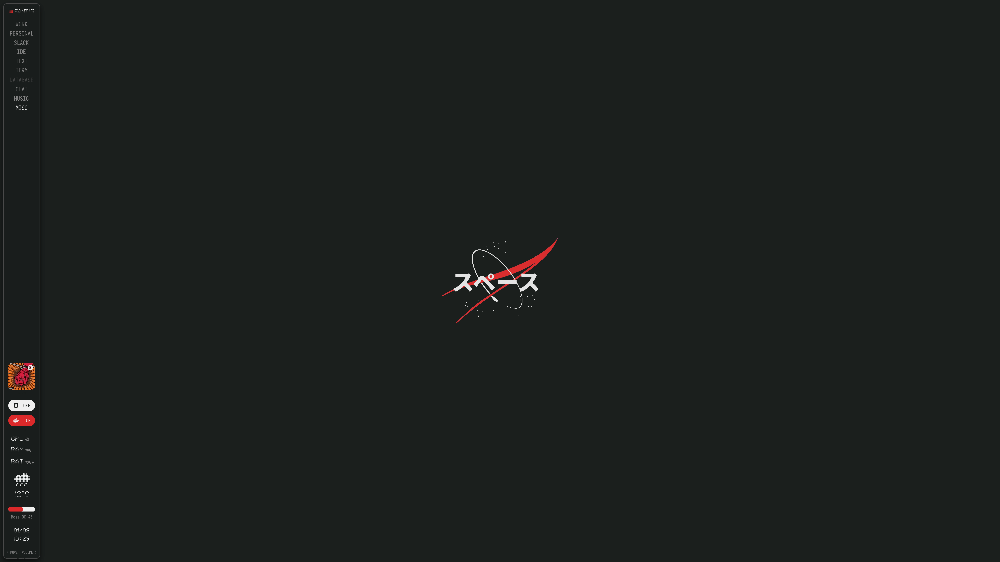

# Sketchybar Dots

### Inspired by NOTHING

## Fonts:
- [Iosevka Nerd Font](https://www.nerdfonts.com/font-downloads)
- [Ndot](./resources/fonts/Ndot-55.otf)

## Requirements:
- [SwitchAudioSource](https://github.com/deweller/switchaudio-osx) for audio source identification
- [Docker Engine](https://docs.docker.com/get-started/) for Docker toggle widget
- [media-control](https://github.com/ungive/media-control) for media cover widget
- [stats-provider](https://github.com/joncrangle/sketchybar-system-stats) for CPU, RAM and Battery information widgets
- [WeatherAPI](https://www.weatherapi.com/) Key for weather widget
